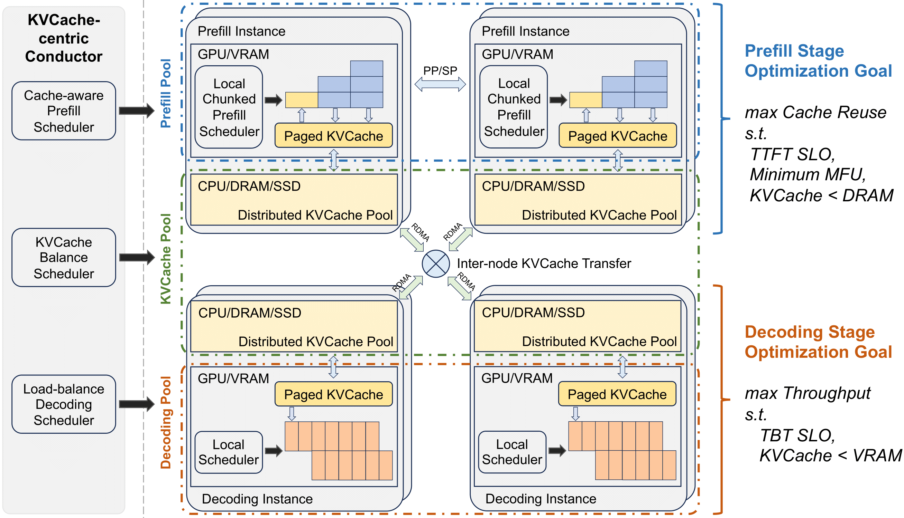

<div align="center">
  <h1>Mooncake: A KVCache-centric Disaggregated<br/> Architecture for LLM Serving</h1>
  <a href="https://arxiv.org/abs/2407.00079" target="_blank"><strong>📃 Technical Report</strong></a>
</div>
<br/>

Mooncake is the serving platform for  <a href="https://kimi.ai/"> Kimi</a>, a leading LLM service provided by <a href="https://www.moonshot.cn/"> Moonshot AI</a>.
Now the core of Mooncake - Transfer Engine is open-sourced!
This repository also hosts its technical report and the open sourced traces. 

<h2 id="updates">🔥 Updates</h2>

 - **Nov X, 2024**: We open sourced the Transfer Engine, the central component of Mooncake. We also provide two demonstrate applications of Transfer Engine: a P2P Store and vLLM integration.
 - **July 9, 2024**: We open sourced the trace as a <a href="https://github.com/kvcache-ai/Mooncake/blob/main/mooncake_trace.jsonl" target="_blank">jsonl file</a>!.
 - **June 27, 2024**: We present a series of Chinese blogs with more discussions on <a href="https://zhuanlan.zhihu.com/p/705754254">zhihu 1</a>, <a href="https://zhuanlan.zhihu.com/p/705910725">2</a>, <a href="https://zhuanlan.zhihu.com/p/706204757">3</a>, <a href="https://zhuanlan.zhihu.com/p/707997501">4</a>.
 - **June 26, 2024**: Initial technical report release.


<h2 id="overview">🎉 Overview</h2>

Mooncake features a KVCache-centric disaggregated architecture that separates the prefill and decoding clusters. It also leverages the underutilized CPU, DRAM, and SSD resources of the GPU cluster to implement a disaggregated cache of KVCache. 



The core of Mooncake is its KVCache-centric scheduler, which balances maximizing overall effective throughput while meeting latency-related Service Level Objectives (SLOs) requirements. Unlike traditional studies that assume all requests will be processed, Mooncake faces challenges due to highly overloaded scenarios. To mitigate these, we developed a prediction-based early rejection policy. Experiments show that Mooncake excels in long-context scenarios. Compared to the baseline method, Mooncake can achieve up to a 525% increase in throughput in certain simulated scenarios while adhering to SLOs. Under real workloads, Mooncake’s innovative architecture enables <a href="https://kimi.ai/">Kimi</a> to handle 75% more requests.

To enable efficient prefill/decode disaggregation, Mooncake proposes the Transfer Engine, which supports rapid, reliable and flexible data transfer over TCP, RDMA, NVIDIA GPUDirect-based RDMA and and NVMe over Fabric (NVMe-of) protocols. Comparing with Gloo (used by Distributed PyTorch) and TCP, Mooncake Transfer Engine has the lowest I/O latency.

<h2 id="show-cases">🔥 Show Cases</h2>

### Use Transfer Engine Standalone ([Intro](doc/zh/architecture.md), [API Doc](doc/zh/api/transfer-engine.md))

Transfer Engine provide unified, batched and asynchronous data transfer APIs. It supports TCP, RDMA (tested over InfiniBand and RoCEv2 networks), NVIDIA GPUDirect-based RDMA and NVMe over Fabric (NVMe-of) protocols. 

Transfer Engine has meticulously engineered to fulfill the following key objectives: 
1) Effectively distribute transfer tasks across multiple RDMA NIC devices; 
2) Abstract the complexities of RDMA connection manage- ment from the APIs; and 
3) Appropriately handle temporary network failures. 

Transfer Engine achieves high performance. With 40 GB of data (equivalent to the size of the KVCache generated by 128k tokens in the LLaMA3-70B model), Mooncake Transfer Engine delivers up to 87 GB/s and 190 GB/s of bandwidth in 4×200 Gbps and 8×400 Gbps RoCE networks respectively, which are about **2.4x and 4.6x faster** than the TCP protocol.


### P2P Store ([Guide]())
The P2P Store is built on the Transfer Engine that supports sharing objects between peer nodes in a cluster. It has been used in the checkpoint transfer service of Moonshot AI.

P2P Store is a client-only architecture, the global metadata is maintained by the etcd services. 
P2P Store provides best-effort guarantee, that is, the data is lost if all replicas are lost.

### vLLM Integration ([Guide]())
Integrating vLLM with Transfer Engine enables prefill/decode disaggregation, optimizing performance by separating the stages. Requests are processed in parallel, with prefill workers preparing data and decode workers generating tokens. This approach boosts throughput, reduces latency, and allows resource allocation tailored to each stage's demands. The outcome is a more efficient, scalable AI system capable of handling high volumes of requests with consistent performance.

**More advanced features will coming soon, so stay tuned!**

<h2 id="quick-start">🚀 Quick Start</h2>

### Preparation
In order to install and use Mooncake, some preparation is required.
- RDMA Driver & SDK (e.g., Mellanox OFED).
- Linux-x86_64 with gcc, g++ (9.4+) and cmake (3.16+).
- Python (3.10 or above)

In addition, to support more features of Mooncake Transfer Engine, we *recommand* you to install the following components:

- CUDA 12.1 and above, including NVIDIA GPUDirect Storage Support, if you want to build with `-DUSE_CUDA`. You may install them from [here](https://developer.nvidia.com/cuda-downloads). 
  ```bash
  # Adding CUDA to PATH
  export PATH=/usr/local/cuda/bin:$PATH
  export LD_LIBRARY_PATH=/usr/local/cuda/lib64:$LD_LIBRARY_PATH
  export CUDA_PATH=/usr/local/cuda
  ```
- Go 1.20+, if you want to build with `-DWITH_P2P_STORE`. You may download it from [here](https://go.dev/dl/).
- Rust Toolclain, if you want to build with `-DWITH_WITH_RUST_EXAMPLE`.

### Installation
1. Init source code
   ```bash
   git clone https://github.com/kvcache-ai/Mooncake.git
   cd Mooncake
   ```

2. Install dependencies
   ```bash
   bash dependencies.sh
   ```

3. Compile Mooncake and examples
   ```bash
   mkdir build
   cd build
   cmake .. # (optional) Specify build options like -D
   make -j
   ```


<h2 id="trace">📦 Open Source Trace</h2>

```json
{
    "timestamp": 27482,
    "input_length": 6955,
    "output_length": 52,
    "hash_ids": [46, 47, 48, 49, 50, 51, 52, 53, 54, 55, 56, 57, 2353, 2354]
}
{
    "timestamp": 30535,
    "input_length": 6472,
    "output_length": 26,
    "hash_ids": [46, 47, 48, 49, 50, 51, 52, 53, 54, 55, 56, 57, 2366]
}
```
The above presents two samples from our trace dataset. The trace includes the timing of request arrivals, the number of input tokens, the number of output tokens, and the remapped block hash. To protect our customers' privacy, we applied several mechanisms to remove user-related information while preserving the dataset's utility for simulated evaluation. More descriptions of the trace (e.g., up to 50% cache hit ratio) can be found in Section 4 of the paper's Version 3.

<h2 id="citation">📑 Citation</h2>
Please kindly cite our paper if you find the paper or the trace is useful:

```bibtex
@article{qin2024mooncake,
  title        = {Mooncake: A KVCache-centric Disaggregated Architecture for LLM Serving},
  author       = {Ruoyu Qin, Zheming Li, Weiran He, Mingxing Zhang, Yongwei Wu, Weimin Zheng, and Xinran Xu},
  year         = {2024},
  url          = {https://arxiv.org/abs/2407.00079}
}
```
