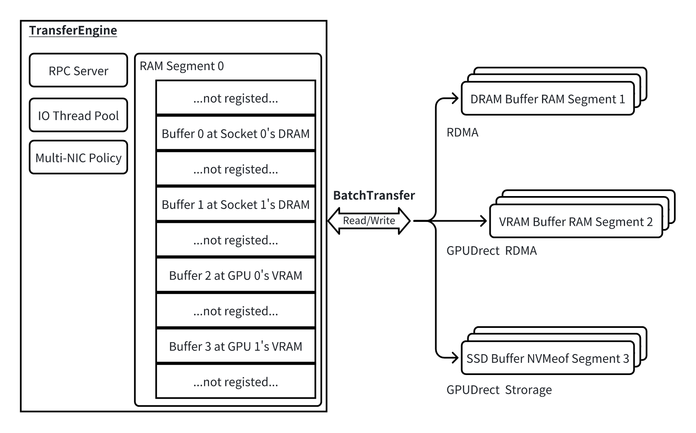

# Mooncake Store

Mooncake Store 是在慢速的对象存储之上基于高速互联的 DRAM/SSD 资源构建的一个池化的多级缓存。和传统缓存比，Mooncake Store 的最大特点是能够基于 (GPUDirect) RDMA 技术尽可能零拷贝的从发起端的 DRAM/VRAM 拷贝至接受端的 DRAM/SSD，且尽可能最大化利用单机多网卡的资源。


## Mooncake Store 的关键组件

### Mooncake Transfer Engine
> 子条目：[Mooncake Transfer Engine 概要](docs/transfer_engine.md)

Mooncake Transfer Engine 是一个围绕 `Segment` 和 `BatchTransfer` 两个核心抽象设计的高性能，零拷贝数据传输库。其中 `Segment` 代表一段可被远程读写的连续地址空间，实际后端可以是 DRAM 或 VRAM 提供的非持久化存储 `RAM Segment`，也可以是 NVMeof 提供的持久化存储 `NVMeof Segment`。`BatchTransfer` 则负责将一个 `Segment` 中非连续的一组数据空间的数据和另外一组 `Segment` 的对应空间进行数据同步，支持 `Read`/`Write` 两种方向，因此类似一个异步且更灵活的的 AllScatter/AllGather。

相应的代码存放在 `mooncake-transfer-engine` 目录下。



### Mooncake Managed Store (WIP)
> 子条目：[Mooncake Managed Store 概要](docs/managed_store.md)

在 Mooncake Transfer Engine 基础上，Mooncake Managed Store 实现由上层控制面和下层数据面组合而成的结构。上层控制面向 Client 提供 Object 级别的 Get/Put 等操作，下层数据面则是提供 VRAM/DRAM/NVM Buffer 层面的尽可能零拷贝和多网卡池化的数据传输。


### Mooncake P2P Store
> 子条目：[Mooncake P2P Store 概要](docs/p2p_store.md)

和由 Master 统一管理空间分配并负责维护固定数量的多个副本的 Mooncake Managed Store 不同，Mooncake P2P Store 的定位是临时中转数据的分发，如 Checkpoint 等。

Mooncake P2P Store 主要提供 `Register` 和 `GetReplica` 两个接口。
Register 相当于 BT 中的做种，可将本地某个文件注册到全局元数据中去，此时并不会发生任何的数据传输仅仅是登记一个元数据。
后续的节点则可以通过 `GetReplica` 去从 peer 拉取对应数据，拉取到的部分自动也变成一个种子供其它 peer 拉取。

Mooncake P2P Store 完全不保证可靠性，如果 peer 都丢了那数据就是丢了。同时也是 client-only 架构，没有统一的 master，只有一个 etcd 负责全局元数据的同步。

相应的代码存放在 `mooncake-p2p-store` 目录下。

## 编译
1. 通过系统源下载安装下列第三方库
   ```bash
   apt-get install -y build-essential \
                      cmake \
                      libibverbs-dev \
                      libgoogle-glog-dev \
                      libgtest-dev \
                      libjsoncpp-dev \
                      libnuma-dev \
   ```

2. 安装 etcd-cpp-apiv3 库（ https://github.com/etcd-cpp-apiv3/etcd-cpp-apiv3 ），请参阅 `Build and install` 一节的说明，并确保 `make install` 执行成功

3. 进入项目根目录，运行
   ```bash
   mkdir build
   cd build
   cmake .. # 可打开根目录下的 CMakeLists.txt 文件更改编译选项，如只编译部分组件
   make -j
   ```

4. 如果编译成功，在项目 `build/mooncake-transfer-engine/tests` 目录下产生测试程序 `transfer_engine_test`，可结合[Mooncake Transfer Engine 概要](docs/transfer_engine.md)文档的描述进行测试。同时，可通过运行 `make build_p2p_store` 命令编译 P2P Store 组件。