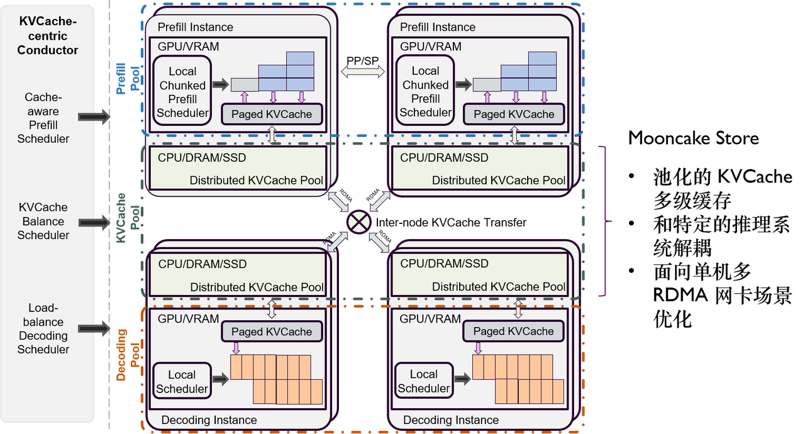

# Mooncake Store

Mooncake Store 是在一个慢速的对象存储之上基于高速互联的 DRAM/SSD 资源构建的一个池化的多级缓存。和传统缓存比，Mooncake Store 的最大特点是能够基于 (GPUDirect) RDMA 技术尽可能零拷贝的从发起端的 DRAM/VRAM 拷贝至接受端的 DRAM/SSD，且尽可能最大化利用单机多网卡的资源。[整体介绍](doc/overview.md)



## Mooncake Store 的关键组件

### Mooncake Transfer Engine
Mooncake Transfer Engine 是一个围绕  Segment 和 BatchTransfer 两个核心抽象设计的高性能，零拷贝数据传输库。其中 Segment 代表一段可被远程读写的连续地址空间，实际后端可以是 DRAM 或 VRAM 提供的非持久化存储 RAM Segment，也可以是 NVMeof 提供的持久化存储 NVMeof Segment。BatchTransfer 则负责将一个 Segment 中非连续的一组数据空间的数据和另外一组 Segment 的对应空间进行数据同步，支持 Read/Write 两种方向，因此类似一个异步且更灵活的的 AllScatter/AllGather。


[Mooncake Transfer Engine 的详细介绍](doc/transfer_engine.md)

### Mooncake Managed Store (WIP)
在 TransferEngine 基础上，Mooncake Managed Store 实际上是上下两层的实现结构。上层控制面向 Client 提供 Object 级别的 Get/Put 等操作，下层数据面则是提供 VRAM/DRAM/NVM Buffer 层面的尽可能零拷贝和多网卡池化的数据传输。具体如下图所示。


### Mooncake P2P Store
和由 Master 统一管理空间分配并负责维护固定数量的多个副本的 Managed Store 不同，P2P Store 的定位是临时中转数据的转存。典型的场景比如 checkpoint 的分发。为此，P2P Store 主要提供 Register 和 GetReplica 两个接口。

Register 相当于 BT 中的做种，可将本地某个文件注册到全局元数据中去，此时并不会发生任何的数据传输仅仅是登记一个元数据。

后续的节点则可以通过 GetReplica 去从 peer 拉取对应数据，拉取到的部分自动也变成一个种子供其它 peer 拉取。

P2P Store 完全不保证可靠性，如果 peer 都丢了那数据就是丢了。同时也是 client-only 架构，没有统一的 master，只有一个 etcd 负责全局元数据的同步。

## 编译与使用

1. 通过系统源下载安装下列第三方库
   ```bash
   apt-get install -y build-essential \
                      cmake \
                      libibverbs-dev \
                      libgoogle-glog-dev \
                      libjsoncpp-dev \
                      libnuma-dev
   ```

2. 安装 etcd-cpp-apiv3 库（https://github.com/etcd-cpp-apiv3/etcd-cpp-apiv3），请参阅 `Build and install` 一节的说明，并确保 `make install` 执行成功

3. 进入项目根目录，运行
   ```
   mkdir build; cd build; cmake ..; make -j
   ```

    正常情况下编译应当成功，如果编译失败请检查上述第三方库是否已经安装，以及 `make install` 是否已经执行成功。将在 `build` 目录下生成静态库文件 `build/src/transfer_engine/libtransfer_engine.a`，与测试用程序 `build/example/transfer_engine_test`。

4. 完成核心组件的编译后，进入 p2pstore 目录执行 make 完成 P2PStore 组件及示例程序的编译。

## 静态库文件的使用
要利用 TransferEngine 进行二次开发，可
- 将 `src/transfer_engine` 目录下的文件整体移入项目目录，或者
- 使用编译好的静态库文件 `build/src/transfer_engine/libtransfer_engine.a` 及 C 头文件 `src/transfer_engine/transfer_engine_c.h`，不需要用到 `src/transfer_engine` 下的其他文件

如果要实现与 Go 语言代码的结合，请参考 `checkpoint` 目录下的样例，特别是 `checkpoint/transfer_engine.go`
```
package main

//#cgo LDFLAGS: -L../build/src/transfer_engine -ltransfer_engine -lstdc++ -lnuma -lglog -libverbs -ljsoncpp -letcd-cpp-api
//#include "../src/transfer_engine/transfer_engine_c.h"
import "C"

.// ...
```
请按实际情况修改 `-L../build/src/transfer_engine`（静态库文件路径）及 `#include "../src/transfer_engine/transfer_engine_c.h"`（头文件）。LDFLAGS 的其他选项不建议调整。

## 样例程序使用
样例程序的代码见 `example/transfer_engine_test.cpp`。使用要点如下:

1. 在机器 E 上启动 etcd 服务，记录该服务的 [IP/域名:端口]，如 optane21:2379。要求集群内所有服务器能通过该 [IP/域名:端口] 访问到 etcd 服务（通过 curl 验证），因此若有必要需要设置集群所有节点的 /etc/hosts 文件，或者换用 IP 地址。

    使用命令行直接启动 etcd，需确保设置 --listen-client-urls 参数为 0.0.0.0：
    ```
    bash
    ./etcd --listen-client-urls http://0.0.0.0:2379 --advertise-client-urls http://<your-server-ip>:2379
    ```

2. 在机器 A 上启动 transfer_engine 服务，模式设置为 target，负责在测试中提供 Segment 源（实际环境中每个节点既可发出传输请求，也可作为传输数据源）

    ```
    ./example/transfer_engine_test --mode=target <通用选项>
    ```
   
    为了正确建立连接，一般需要设置下列通用选项：
    - metadata_server：为开启 etcd 服务机器 E 的 [IP/域名:端口]，如 optane21:12345。
    - local_server_name：本机器 [IP/域名]，如 optane20，如果不设置，则直接使用本机的主机名。本机内存形成的 Segment 名称与 local_server_name 一致。其他节点会直接使用 local_server_name（可为 IP 或域名形态）与本机进行 RDMA EndPoint 握手，若握手失败则无法完成后续通信。因此，务必需要保证填入的参数是有效的 IP 或域名，若有必要需要设置集群所有节点的 /etc/hosts 文件。
    - nic_priority_matrix：网卡优先级矩阵。一种最简单的形态如下：
        ```
        {  "cpu:0": [["mlx5_1", "mlx5_2", "mlx5_3", "mlx5_4"], []] }
        ```
        表示，对于登记类别（即 registerMemory 的 location 字段）为 "cpu:0" 的内存区域，优先从 "mlx5_1", "mlx5_2", "mlx5_3", "mlx5_4" 中随机选取一张网卡建立连接并传输。

3. 在机器 B 上再启动一个 transfer_engine 服务，用以发起 transfer 请求。segment_id 表示测试用 Segment 来源，在这里就是机器 A 的 [IP/域名]。
    ```
    ./example/transfer_engine_test --segment_id=[IP/域名] <通用选项>
    ```
    此外，operation（可为 read 或 write）、batch_size、block_size、duration、threads 等均为测试配置项，其含义不言自明。

