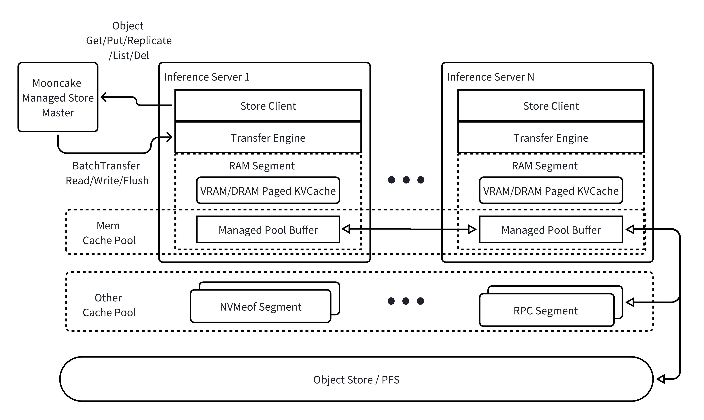

# Mooncake Store 总体架构

## 设计目标和约束

Mooncake Store 的目标是在一个慢速的对象存储之上，通过高速互联的 DRAM/SSD 资源，实现一个池化的多级缓存。和传统缓存比，Mooncake Store 最大特点是能够基于 (GPUDirect) RDMA 技术尽可能零拷贝的从发起端的 DRAM/VRAM 拷贝至接受端的 DRAM/SSD，且尽可能最大化利用单机多网卡的资源。

- 以 Object Get/Put 而非 File Read/Write 为核心抽象管理数据，且最小分配单元为 16KB，即不针对小对象优化。
- 支持在缓存层多副本保存数据，但不保证绝对的高可用，极端情况下仅写入了缓存层还未异步刷入下层慢速对象存储上的数据会丢失
- 保证 Object Put 的原子性，即 Get 一定会读到某次 Put 生成的完整的数据。但不保证 Linearizability，即 Get 可能不会读到最新一次 Put 的结果。 提供一个类似 ZooKeeper 的 Sync 操作来强制达成 freshness 的要求。
- 对较大的 Object 进行条带化和并行处理。Object Size 较大时单个 Object 的 Get/Put 就需要可以利用多网卡的聚合带宽。
- 缓存对象支持 Eager/Lazy/None 三种下刷慢速对象存储的模式，分别对应持久化要求从高到低的对象。
- 支持动态增删缓存资源。
- Mooncake Store 本身虽然是缓存层但自身语义是 store 而非 cache，不实现缓存替换和冷热识别等策略。策略由上层实现，Mooncake Store 本身只提供在各个缓存层之间迁移和删除以及必要的统计信息上报接口。

## 架构概览

基于上述目标，Mooncake Store 的实现结构可分为两个层次。

- 上层控制面对外提供对象（Object）级别的 Get/Put 等操作；
- 下层数据面则是提供 VRAM/DRAM/NVM Buffer 层面的尽可能零拷贝和多网卡池化的数据传输。同时这一层次也可以单独抽象出来形成一个独立的 Transfer Engine。

### Master 节点
Master 节点主要负责 Object 到 VRAM/DRAM/NVM Buffer 的映射关系和对应的空间管理策略。这部分业务逻辑主要由 `mooncake-allocator` 目录下的组件承担。驱动具体的节点执行数据传输操作由内嵌的 [Transfer Engine](transfer-engine.md) 组件实现。

- Buffer 的空间分配管理
- 维护从 Object Key 到具体的 Buffer 的映射关系
- 驱动具体的节点执行数据传输操作

### Managed Pool Buffer 节点
Managed Pool Buffer 仅负责提供空间和执行具体的数据传输（数据从远程缓冲区到本地缓冲区之间的搬运等）任务。后者同样由内嵌的 [Transfer Engine](transfer-engine.md) 组件实现。

## Master 组件概述
### 空间分配与数据传输组件 `mooncake-allocator`
空间分配机制是一个标准的 SLAB Allocator，但实际上的空间不在 Master 本地而是在对应的 Managed Pool Buffer 节点上，Master 仅维护可用地址等元数据信息。

Master 在收到用户的 Get/Put/Replicate 操作后，首先根据自身保存的元数据进行必要的空间分配并获取对应的指针。在分配完成后，Master 将用户的操作分解成多个 Transfer Engine 可识别的数据传输任务，实质上是从一台或多台 Managed Pool Buffer 指向的 DRAM/VRAM/NVMe 上，经由 RDMA/NVMeof 协议完成数据传输任务。Transfer Engine 将在 Master 侧提供一个异步接口，用于驱动作用于单个 Managed Pool Buffer 的数据传输任务。

## Managed Pool Buffer 组件概述

### Segment
Managed Pool Buffer 可维护多种形式的缓冲区。所谓缓冲区，指的是由 Transfer Engine 实现数据传输过程所涉及的源地址范围及目标地址范围。「地址」可以是 DRAM/VRAM 地址，也可以是某个位于 NVMe 的文件偏移地址。

- 第一类：每一个进程启动时自动创建一个以自身 local_hostname 为名称的缓冲段（Segment）。在 Transfer Engine 中，其他进程可使用该名称引用 Segment，从而实施读写操作。一个进程只有一个 Segment。
    - 在 Managed Pool Buffer 中，预分配一段 DRAM/VRAM 地址空间并纳入 Segment，这样 Master 节点可对这一块空间进行中心化分配，这一块空间同样也作为全局池化 DRAM Cache Pool 的组成部分。
        > 一个 Segment 内的内存范围不需要是连续的，也就是说，可以通过分配多段DRAM/VRAM 地址空间并纳入相同的 Segment。
    - Managed Pool Buffer 也可以注册一些本地 DRAM 区域，这一部分区域仅仅是作为数据操作的本地侧存储空间，分配管理不由 Master 负责。比如 vLLM 的 DRAM PageCache 区域。

- 第二类：被注册到 NVMeof 中的一段 SSD 空间。在 Transfer Engine 中，两类 Segment 的使用接口是基本相同的。其分配管理除非特别指定，否则也是由 Master 节点进行中心化分配，同样也作为全局池化 DRAM Cache Pool 的组成部分。

对于两类 Segment，Managed Pool Buffer 都不知道本地空间哪些被分配了哪些没有，只是被动地接受 Master 直接通过 `offset` 指定的对应区间之间的数据传输请求。

### 对象的切分与多副本

Client 除了可以通过 Get/Put 操作获取或写入某个 key 对应的数据外，还可以通过 Replicate 命令改变一个 Object 的复制状态。复制状态可以用三元组描述：
```
{
    dram_replicate_num: int, 
    nvmeof_replicate_num: int, 
    flush: {Eager/Lazy/None}
}
```
例如，对于一个 key 为 ID、大小为 size、版本为 ver 的对象。实际上会被存储为：

- `dram_replicate_num \* ceil(size/dram_shard_size)` 个 DRAM Block，标号可描述为 `ID-ver-DRAM_Replica_i-Shard_j`。
    
    其中 `dram_shard_size` 为全局配置项，取决于最小多小能跑满 RDMA（4KB 应该就够）
- `nvmeof_replicate_num \* ceil(size/nvmeof_shard_size)` 个 SSD Block，标号分别为 `ID-ver-NVMeof_Replica_i-Shard_j`。
    
    其中 nvmeof_shard_size 为全局 config，取决于最小多小能跑满 NVMeof。
- 一个（或零个，如果 flush=None）下层对象存储上的对象，key 为 ID

在上层缓存层每一次的 Put 实际上都会获得一个新的 version 所以实际上下层存储空间是不共享的，也就是不支持 in-place update。这样比较方便保证原子性，旧版本异步自动空间回收就行。但是最下层只有一个版本，由 Master 保证按照 version 顺序下刷（flush=Lazy 的情况可能跳过一些中间版本）。

Replicate 操作如果增加或者删除了副本数量的话 Master 自己通过空间管理和调用数据面的操作来达成对应分布。类似的机制也可以用在故障恢复中。

### 数据通路

借助 Transfer Engine，Mooncake Store 可实现本地 DRAM/VRAM 通过 (GPUDirect) RDMA 读写本地/远端的有效 Segment（注册的 DRAM/VRAM 区间及 NVMe 文件）中的某一段。
- Local memcpy: 如果目标 Segment 其实就在本地 DRAM/VRAM 的话，直接走 memcpy、cudaMemcpy
- RDMA Verbs: 目前支持本地 DRAM/VRAM 与远程 DRAM 之间的数据传递
  - DRAM 都需要注册成 RDMA 的 memory region
  - VRAM 目前考虑不强制注册，而是每张 GPU 上开一小块 VRAM Buffer，仅仅注册这一块 Buffer。实际传输的时候内部拷贝一次再 GPUDirect RDMA 传输
  - 支持多网卡池化，同样是大块切小块然后每一个小块按照当前对网卡繁忙程度的估计选一个丢出去

- cuFile (GPUDirect Storage): 计划实现本地 DRAM/VRAM 与 Local/Remote NVMeof 之间的数据传递。
